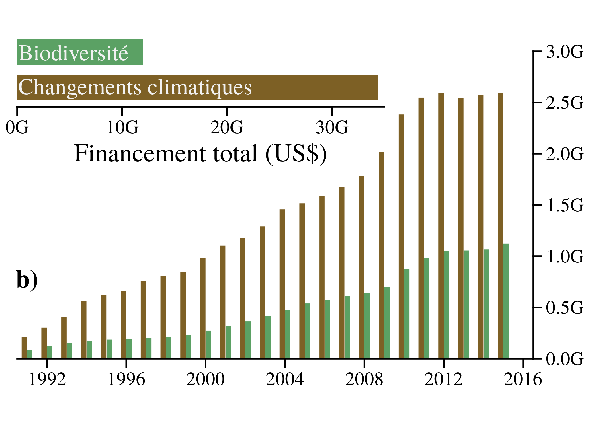

# burningHouse

## Description

This repository includes the data, analyses and how to reproduce figures found
in the article *Our house is burning: discrepancy in climate change vs
biodiversity coverage in the media* by Legagneux *et al.* (2018)
DOI: [10.3389/fevo.2017.00175](https://www.frontiersin.org/articles/10.3389/fevo.2017.00175/abstract).

We have used a standard R package to:

  1- efficiently assess the quality of our code (here we simply used `R CMD check`);

  2- readily share our code (see installation section below).

We however acknowledge that despite the form of a standard R package, the code
presented is more a organized script than a package (*i.e.* functions included
are not general).

## Current status

[](https://travis-ci.org/KevCaz/burningHouse)
[](https://ci.appveyor.com/project/KevCaz/burninghouse/branch/master)


## Abstract of the article

> Scientists, policy makers and journalists are three key, interconnected players involved in prioritizing and implementing solutions to mitigate the consequences of anthropogenic pressures on the environment. We extensively scrutinized the scientific literature, research funding and press articles from the USA, Canada and United Kingdom addressing climate change and biodiversity issues between 1991 and 2016. We found that media coverage of climate change was up to eight times greater compared to biodiversity. This discrepancy could not be explained by different scientific output between the two issues. Moreover, climate change media coverage was often related to specific events whereas no such indication of a connection was found in the case of biodiversity. An international communication strategy is deeply required to raise public awareness on biodiversity issues, which in turn could provide rewards both in terms of increased research funding and discoveries.


## Installation

The easiest way is to use the [devtools](https://cran.r-project.org/web/packages/devtools/index.html)
R package. Once installed, use the following commands in your favorite R console:

```r
library(devtools)
install_github('KevCaz/burningHouse')
```


## Data

We collected data, stored them as data frames and listed them below:

- **events**: international events reported on figure 2 (see below);  
- **fundingsUSCA**: fundings time series (yearly frequency);  
- **newsPaper**: number of articles in the newspapers' time series (yearly frequency);
- **newsNames**: names of the newspapers included in the study;    
- **sciPaper**: time series of scientific articles (yearly frequency);    
- **sciNames**: number of scientific paper we retrieved per journal title.

To manipulate these data frames, the user should first call the `data()`
function like so:

```r
data(newsNames)
```

The data frame is then usable, for instance:

```r
knitr::kable(newsNames)
```

yields:

|country |name                    |
|:-------|:-----------------------|
|Canada  |The Globe and Mail      |
|Canada  |National Post           |
|Canada  |The Toronto Star        |
|Canada  |Winnipeg Free Press     |
|USA     |The New York Times      |
|USA     |USA Today               |
|USA     |The Wall Street Journal |
|USA     |The Washington Post     |
|UK      |Financial Times         |
|UK      |The Guardian            |
|UK      |The Independent         |
|UK      |The Times               |


Also for each dataset, details are provided in the documentation associated. To
access this documentation the user can either use `?` or `help()`:


```r
?newsNames
```


## Figures

Creating the figures below required to 1- collect data and 2- do a peaks
detection analysis. Data are available as data frames (listed above) and the
peaks detection analysis is presented as a example of the `detectPeaks()`
function we used.


### Figure 1a

```r
data(sciPapers)
grDevices::png('inst/fig/ms-figure1a.png', height = 5, width = 7, res = 300, unit = 'in')
  figure1a(
    sciPapers$year,
    sciPapers$records_CC,
    sciPapers$records_BD,
    col1 = "#604a3c", col2 = "#69ab78"
  )
grDevices::dev.off()
```


### Figure 1b

```r
data(fundingUSCAN)
grDevices::png("inst/fig/ms-figure1b.png", height = 5, width = 7, res = 300, unit = "in")
  figure1b(
    fundingUSCAN$year,
    fundingUSCAN$CC_CA + fundingUSCAN$CC_US,
    fundingUSCAN$BD_CA + fundingUSCAN$BD_US,
    col1 = "#604a3c", col2 = "#69ab78"
  )
grDevices::dev.off()
```




### Figure 2

```r
data(events); data(newsPapers);
grDevices::png(file='inst/fig/ms-figure2.png', width = 8, height = 6, res = 300, unit = 'in')
  figure2(events, newsPapers, col1 = "#604a3c", col2 = "#69ab78")
grDevices::dev.off()
```


## To do

- [ ] add a DOI to the code (Zenodo).
