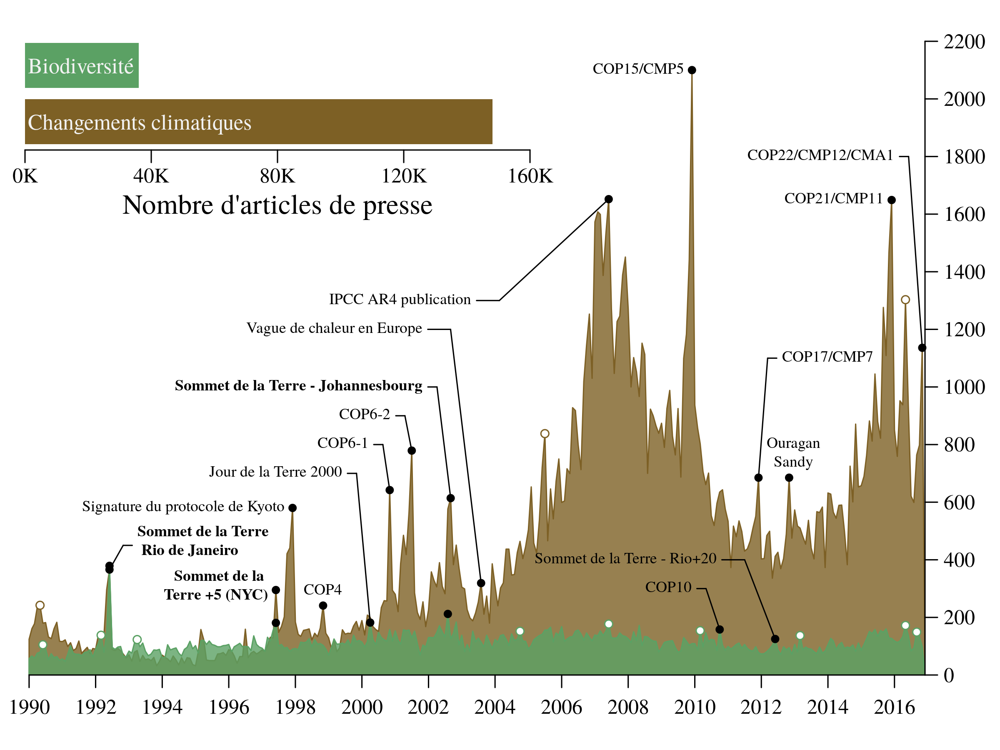

# Our house is burning: discrepancy in climate change vs biodiversity coverage in the media


## Abstract

To be added.


## Why this repository?

This repository reproduces the figures found in XXXXXX.
The reasons for using a standard R package are  twofold:

1- efficiently assessing the code quality of the code (here we simply use `R CMD check`)

2- make the sharing of the code easy (especially if you have an adequate version
  of R, you will be able to install the package irrespective of your OS)


## Installation

We recommend to use the [devtools](https://cran.r-project.org/web/packages/devtools/index.html)
R package. Once installed, you can install the package using the following
commands in your favorite R console:

```r
library(devtools)
install_github('KevCaz/burningHouse')
```

## Figures

### Figure 1b

```r
data(fundingUSCAN)
grDevices::png("inst/fig/ms-figure1b.png", height = 5, width = 7, res = 300, unit = "in")
  figure1b(
    fundingUSCAN$year,
    fundingUSCAN$CC_CA + fundingUSCAN$CC_US,
    fundingUSCAN$PB_CA + fundingUSCAN$PB_US
  )
grDevices::dev.off()
```

<!--  -->


### Figure 2

```r
data(events); data(monthcan); data(monthusa); data(monthgbr)
grDevices::png(file='inst/fig/ms-figure2.png', width = 8, height = 6, res = 300, unit = 'in')
  figure2(events, monthcan, monthusa, monthgbr)
grDevices::dev.off()
```

<!--  -->


## To do

- [X] add figure 1a;
- [ ] add figure 1b;
- [ ] add a DOI to this repository once the paper is published.
